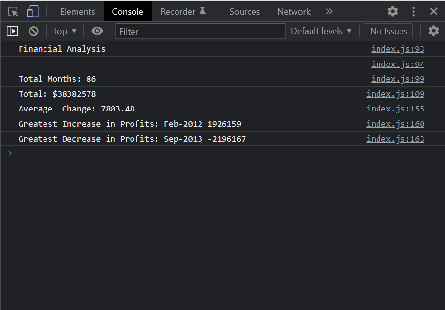

# Console-Finances

## Description

This JavaScript application analyzes records of Date and Profit/Losses. It calculates and displays to the console:
- The total number of months included in the dataset.
- The net total amount of Profit/Losses over the entire period.
- The average of the changes in Profit/Losses over the entire period.
- The greatest increase in profits (date and amount) over the entire period.
- The greatest decrease in losses (date and amount) over the entire period.

## Installation

N/A

## Usage

Use the url below and open the console from the developers tool to view the Financial analysis results. 

https://marinaongithub.github.io/Console-Finances

## Credits

N/A

## License

N/A
